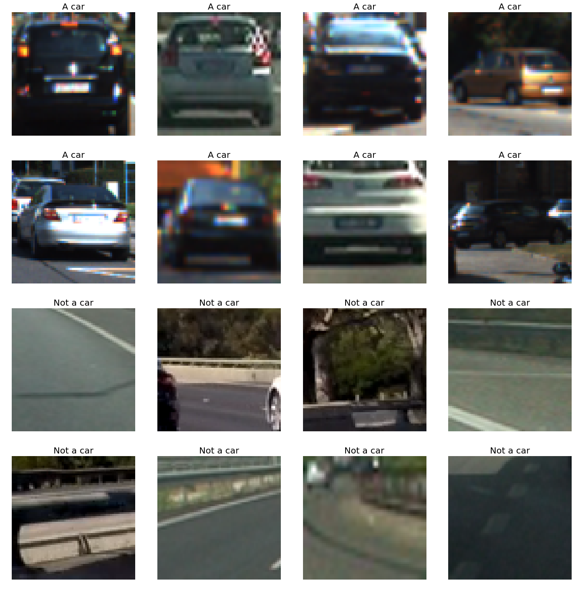
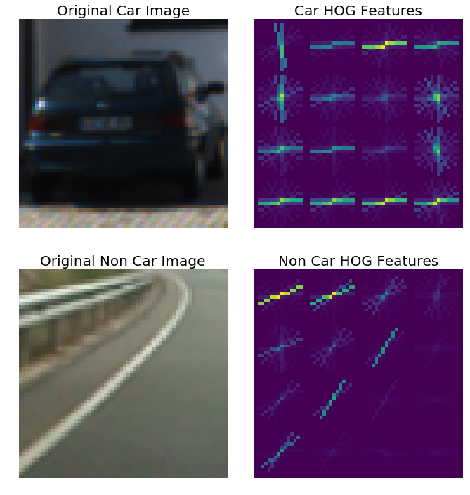
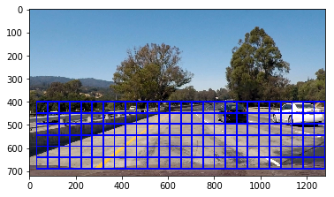
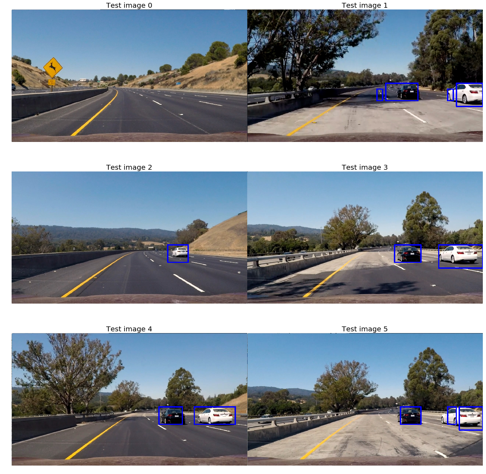
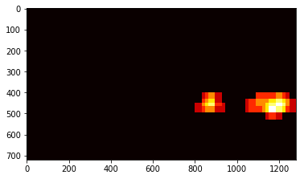
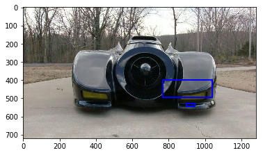

## Vehicle Detection Project

### The goals / steps of this project are the following:

* Perform a Histogram of Oriented Gradients (HOG) feature extraction on a labeled training set of images and train a classifier Linear SVM classifier
* Optionally, you can also apply a color transform and append binned color features, as well as histograms of color, to your HOG feature vector.
* Implement a sliding-window technique and use your trained classifier to search for vehicles in images.
* Run your pipeline on a video stream (start with the test_video.mp4 and later implement on full project_video.mp4) and create a heat map of recurring detections frame by frame to reject outliers and follow detected vehicles.
* Estimate a bounding box for vehicles detected.

**Data Exploration.**

Below are 8 images each from car and non car data sets. 

### Rubric Points
Here I will consider the rubric points individually and describe how I addressed each point in my implementation.

**Histogram of Oriented Gradients (HOG)**

1. Explain how (and identify where in your code) you extracted HOG features from the training images. Explain how you settled on your final choice of HOG parameters.

    The code for this step is contained in the Step 1 code cell of the IPython notebook.
    Below is the result of HOG function on car and non-car images. After trying with different values of hyperparameters,  I found the orient = 11, pix_per_cell = 16 and cell_per_block = 2 are giving pretty good results.
    

2. Describe how (and identify where in your code) you trained a classifier using your selected HOG features (and color features if you used them).

    Along with HOG features, I have also added Spatial Bining and Color Histogram features in my list of features. I used a SVM (Support Vector Machine) as a classifies. I used kernal as RBF. I have also tried with a Linear type kernel but RBF is giving better result on the cost of more processing time. The code for this is in 16th block of Jupyter Notebook.
    
    Here are some important details regarding training. 
    
    Using: 11 orientations 16 pixels per cell and 2 cells per block

        Feature vector length: 2004
        109.35 Seconds to train SVC...
        Trained and model saved

**Sliding Window Search**

1. Describe how (and identify where in your code) you implemented a sliding window search. How did you decide what scales to search and how much to overlap windows?

    A sliding window approach has been implemented in the block 6 of P5.ipynb, where overlapping tiles in each test image are classified as vehicle or non-vehicle. The prediction for each window is performed by the classified predict function. If the result is true i.e. a car is present in the window then that window is selected as an hot window, I have done this step with windows of different sizes to classify cars of different size in the video.
    
    

2. Show some examples of test images to demonstrate how your pipeline is working. How did you optimize the performance of your classifier?

    I tested my pipeline on all the 6 images, here is the result.
    
    

**Video Implementation**

1. Provide a link to your final video output. Your pipeline should perform reasonably well on the entire project video.

    Video file named project_video_output.mp4 is submitted along with the project.
    
    
2. Describe how (and identify where in your code) you implemented some kind of filter for false positives and some method for combining overlapping bounding boxes.

    Heat map is generated on the for the windows on the images. This is done using add_heat function in the P5.ipynb file. Later on threshold is applied, and only heat pixels with value of 2 or more, which signifies that at least 2 frames of windwos has detected presence of a car here. This reduces the chances of getting a false positive. Later on, using scipy label function, irregular boxes of heat maps are made are given a rectangular shape. All the above steps are merged in a single function named get_heat_scale. Below image is result of heat map, before label is applied.
    
    
    

**Discussion**

1. Briefly discuss any problems / issues you faced in your implementation of this project. Where will your pipeline likely fail? What could you do to make it more robust?

    A. Problems
    The result of labels is not a proper rectangle as it only joins adjacent pixels. I provided different structure parameter to join even diagonally connected pixels but the results were still same. Some averaging should be applied to get proper rectangular shapes. I skipped this part, and may try to implement this in future. 
    
    B. Failure point.
    The program may fail in following cases.
    1. Lots of traffic on road, and large number of cars standing in front. The heat map will give a large heat clustur and label will predict all as a single big car, like a tank is there on raod.
    2. Car moving at a very high speed, the heat threshold in this case will be only 1 and will get rejected.
    3. If Batmobile comes in front of our car, it won't be classified as a car because data for this is not present in training set. 
        

At least a little part is detected. :D. 

Thanks for reading.
